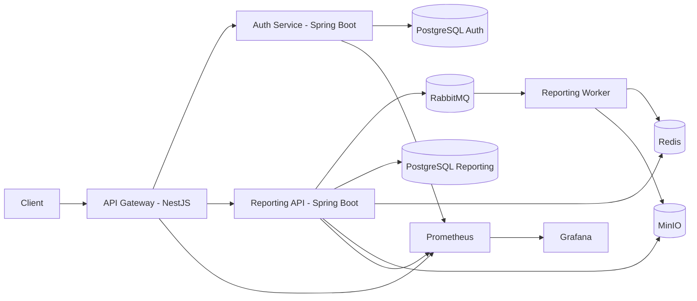

# Architecture

## Service responsibilities

- **Gateway**: auth guard, RBAC guard, rate limit, correlation ID propagation, request forwarding.
- **Auth Service**: organizations, users, signup/login/refresh/logout, user status controls.
- **Reporting Service**: CSV upload, report jobs, artifact downloads, analytics, async processing.

## Security model

- Access tokens: JWT (15 min default)
- Refresh tokens: revocable hashed token entries in auth DB
- RBAC roles: `ADMIN`, `ORG_HEAD`, `EMPLOYEE`
- Org isolation enforced in query layer and service authorization checks
